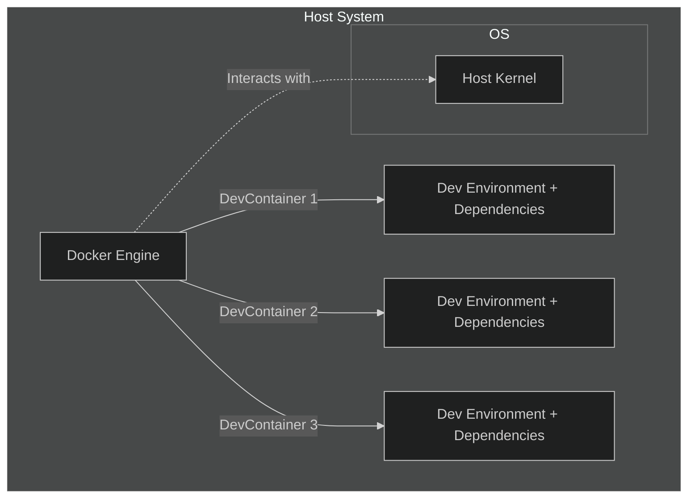

# Introduction to DevContainers

DevContainers, short for Development Containers, are a powerful tool for creating consistent development environments. By leveraging containerization technology, DevContainers enable developers to define a complete development environment, including all dependencies, in a single configuration file. This ensures that every developer on a project can work in the exact same environment, eliminating the "works on my machine" problem.

## What are DevContainers?

DevContainers are development environments defined by a `devcontainer.json` configuration file that specifies the Docker image or Dockerfile to use, along with any extensions, settings, and dependencies required for the project. These containers run in isolated environments, ensuring that the development setup is consistent across different machines and teams.

> [!TIP]
> That looks very familiar, right? Because it should. DevContainers make use of Docker.

---

## Benefits of Using DevContainers

 - **Consistency** -> Every developer works in the same environment, ensuring consistent behavior across different development machines.
 - **Portability** -> DevContainers can be easily shared and reproduced on any system that supports Docker, making it easy to onboard new developers.
 - **Isolation** -> Development environments are isolated from each other and from the host system, preventing  - conflicts and ensuring clean setups.
 - **Simplicity** -> Setup is defined in a single configuration file (devcontainer.json), reducing the complexity  - of environment setup and management.
 - **Integration** -> DevContainers integrate seamlessly with popular development tools like Visual Studio Code and GitHub Codespaces, enhancing the development workflow.

---

## DevContainers vs. Traditional Development Environments

 - **Setup Time**
    - **DevContainers** -> Quick setup with a predefined configuration file, reducing the time spent on environment configuration.
    - **Traditional Environments** -> Manual setup can be time-consuming and prone to errors, especially when setting up multiple dependencies.

- **Consistency**
    - **DevContainers** -> Ensures that all developers work in identical environments, eliminating discrepancies.
    - **Traditional Environments** -> Variations in setup across different machines can lead to inconsistent behavior and hard-to-track bugs.

- **Isolation**
    - **DevContainers** -> Each environment runs in an isolated container, preventing conflicts and ensuring clean states.
    - **Traditional Environments** -> Dependencies and tools installed on the host system can interfere with each other, leading to potential conflicts.

- **Portability**
    - **DevContainers** -> Easily portable across different systems, as long as Docker is supported.
    - **Traditional Environments** -> Difficult to replicate exactly across different machines, leading to potential inconsistencies.

- **Maintenance**
    - **DevContainers** -> Simplified maintenance with a single configuration file that defines the environment.
    - **Traditional Environments** -> Requires manual updates and maintenance, which can be error-prone and inconsistent.

---

By leveraging DevContainers, development teams can streamline their workflow, ensure consistent environments, and reduce setup time, ultimately improving productivity and reducing the likelihood of environment-related issues.

> [!TIP]
> Simplify your development environment setup and eliminate discrepancies by using DevContainers.  
> Consistent, portable, and efficient.