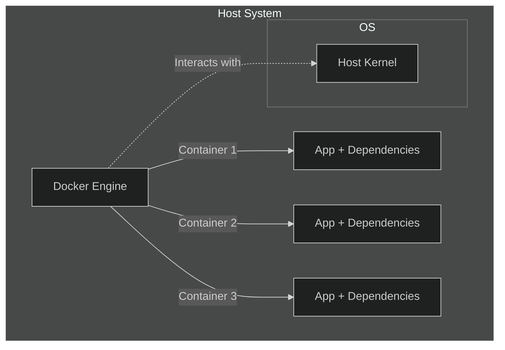

# Introduction to Docker

Docker is a platform designed to simplify the development, deployment, and operation of applications by using *containerization*. Containers allow developers to package an application with all its dependencies into a standardised unit for software development, ensuring consistency across multiple environments.

> [!NOTE]
> Behaviour will be consistent irrespective of host OS.

### What are containers?

Containers are lightweight, standalone, executable packages that include everything needed to run a piece of software, including the code, runtime, system tools, libraries, and settings. They share the host system's kernel but run in isolated user spaces. Containers allow developers to create predictable environments that are consistent across various stages of development and deployment.

---

### Benefits of using containers

- **Portability** -> Containers can run on any system that supports the container runtime, ensuring that applications work consistently across different environments.
- **Efficiency** -> Containers share the host system's kernel and resources, making them more efficient and faster to start than traditional virtual machines.
- **Isolation** -> Each container runs in its own isolated environment, preventing conflicts between applications running on the same host.
- **Scalability** -> Containers can be easily scaled up or down, making it straightforward to handle varying workloads.
- **Simplified Development and Deployment** -> Containers streamline the development workflow by allowing developers to work in environments that closely match production. This reduces the "it works on my machine" problem.

---

### Containers vs. Virtual Machines

- **Architecture**
  - **Containers** -> Share the host system's kernel and resources, running as isolated processes in user space.
  - **Virtual Machines** -> Include a full guest operating system, running on top of a hypervisor, which abstracts the hardware.

- **Resource Utilization**
  - **Containers** -> Lightweight, with minimal overhead, as they share the host OS kernel.
  - **Virtual Machines** -> More resource-intensive due to the overhead of the guest OS and hypervisor.

- **Performance**
  - **Containers** -> Faster to start and stop due to their lightweight nature.
  - **Virtual Machines** -> Slower to boot up and shut down because of the need to start and stop the guest OS.

- **Isolation:**
  - **Containers** -> Provide process-level isolation, which is sufficient for most applications but less secure than full isolation.
  - **Virtual Machines** -> Offer full isolation by virtualizing the entire hardware stack, providing strong security boundaries.

- **Use Cases**
  - **Containers** -> Ideal for microservices, application deployment, and environments where resource efficiency is crucial.
  - **Virtual Machines** -> Suitable for running multiple different OSes on the same physical hardware, legacy applications requiring a specific OS, and scenarios requiring strong isolation.

By understanding the differences and benefits of containers, developers can make informed decisions about when and how to use them effectively in their projects.

> [!TIP]
> Get rid of the inevitable "*it works on my machine*" or multiple users setting up over and over.  
> **Do it once; do it right.**
