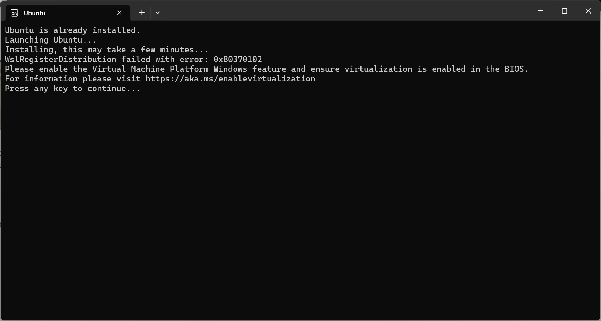

# Getting Started with Docker

## Installing Docker on various operating systems

> [!ATTENTION]
> Why not Docker Desktop?  
> Let's address the elephant in the room -> [Docker Desktop](https://www.docker.com/products/docker-desktop/) simplifies and streamlines the setup of Docker on your machine. You should probably just use that.  
>
> We install direct as we *were* running with Docker inside Dyson, which had many employees, few Docker Desktop licenses, and a heap of hoops to jump through for new ones.

The steps required to get up and running across Windows, Mac, and GNU/Linux are similar, but do vary.

We'll primarily focus on running in Windows (as we no longer have multiple machines!)

### Windows

#### Pre-Requisites

We're going to focus on up-to-date install of Windows. Everything can be set up on older versions, but the steps differ.

1. Windows 10/11 version greater than 22H2
   1. Can be checked using `WinVer`
1. Virtualisation enabled in BIOS
   1. 
   1. Steps to enable vary by platform (AMD/Intel) and BIOS vendor
      1. e.g. For ASUS, look in `CPU Configuration` for `SVM Mode` on AMD, or `VMX` on Intel

#### Scripts

1. Wrapper to call elevated PowerShell [run_me_to_install.sh](assets/run_me_to_install.sh ':ignore')
   1. On first run, you'll be prompted to restart, enter `Y`
   1. On second run, enter `N`
1. Runner to install WSL2 and Ubuntu [setup_wsl.ps1](assets/setup_wsl.ps1 ':ignore')
1. Run inside WSL2 instance [install_docker.sh](assets/install_docker.sh ':ignore')
   1. If Shebang issues `sed -i.bak 's/\r$//' install_docker.sh`

> [!ATTENTION]
> These scripts have been thrown together quickly, they've not been through any level of shakedown testing, nor sanity review.

---

## Example Dockerfile

## Basic Docker concepts: images, containers, Docker Hub
